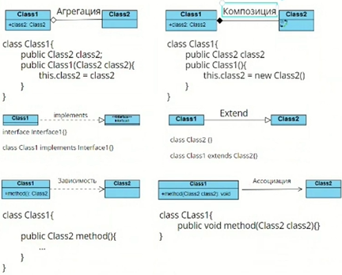

# Architecture

Виды связей
  - Зависимость (метод класса1 возвращает класс2)
  - Ассоциация (метод класса1 как параметр принимает класс2)
  - Имплементация (класс1 реализует интерфейс)
  - Наследование (класс1 наследуется от класса2    
  - Агрегация (класс1 в конструкторе принимает переменную класса2) - время жизни разное
  - Композиция (в конструкторе класса 1 создаем переменную класса2) - время жизни одинаковое

